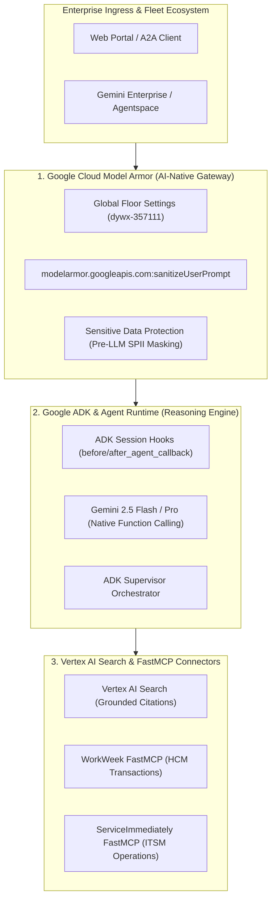

# Google Architectural Differentiators & Innovations in Project Elevate

## Executive Summary

**Project Elevate** is engineered natively on the **Google Cloud AI & Agent Platform**, leveraging next-generation architectural capabilities that distinguish Google's AI ecosystem from generic LLM wrapper frameworks. Rather than relying on fragmented third-party glue code, Elevate unifies **Google Agent Development Kit (ADK)**, **Google Cloud Model Armor**, **Vertex AI Search Grounding**, and **Gemini 2.5** into a zero-trust, enterprise-grade agentic solution.

This document highlights the **core architectural differentiators and Google innovations** that provide measurable advantages in enterprise security, deterministic reliability, multi-system orchestration, and Total Cost of Ownership (TCO).

---

## 1. Unified Architectural Pillar Overview



---

## 2. Deep-Dive: Core Google Architectural Differentiators

### 🛡️ Differentiator 1: Google Cloud Model Armor (AI-Native Security Gateway)

**Industry Challenge**: Traditional Web Application Firewalls (WAFs) only inspect HTTP layer-7 payloads and are blind to semantic prompt injections, jailbreaks, and indirect prompt extraction hidden inside enterprise database records.

**Google Innovation & Elevate Implementation**:
* **Cloud-Native AI Defense (`modelarmor.googleapis.com`)**: Elevate leverages Google Cloud Model Armor to sanitize user prompts before tokenization by the LLM.
* **Centralized Enterprise Floor Settings (`floorSetting`)**: Security administrators enforce mandatory organization-wide baseline filters (`piAndJailbreakFilterSettings`) at the Google Cloud project/folder level without touching application code.
* **Dual-Layer Defense Architecture**:
  1. *Layer 1 (Zero-Latency Client Inspection)*: Immediate regex-based SPII masking (`[SSN_REDACTED]`, `[PHONE_REDACTED]`) and prompt boundary checks in [`agent/guardrails.py`](file:///usr/local/google/home/levichen/Documents/brd2sdd/elevate-bj-g4/agent/guardrails.py).
  2. *Layer 2 (Cloud Model Armor API)*: Real-time semantic analysis detecting multi-turn jailbreaks and policy breaches.
* **Auditability**: Complete defense telemetry streamed automatically to **Google Cloud Logging** for enterprise compliance and security operations (SecOps).

```
+-----------------------------------------------------------------------------+
|               MODEL ARMOR DUAL-LAYER SECURITY PIPELINE                      |
|                                                                             |
|  User Prompt ──► [Edge Heuristic / SDP Masking] ──► [Model Armor REST API]  |
|                         │                                  │                |
|                    SSN Redacted                     Jailbreak Blocked       |
|                         ▼                                  ▼                |
|               [Safe Prompt to Gemini]             [403 Security Refusal]    |
+-----------------------------------------------------------------------------+
```

---

### ⚡ Differentiator 2: Google Agent Development Kit (ADK) & Agent Runtime

**Industry Challenge**: Open-source agent frameworks (e.g., LangChain/CrewAI) often suffer from fragile prompt serialization, unpredictable JSON parsing errors, lack of deterministic lifecycle hooks, and heavy runtime overhead.

**Google Innovation & Elevate Implementation**:
* **Deterministic Session Lifecycle Hooks**:
  * `before_agent_callback`: Guarantees session context initialization, caller authentication (`employee_id`), and tenancy validation *before* the model plans tool calls.
  * `after_agent_callback`: Inspects model outputs for post-generation safety, ensuring zero SPII leakage.
* **Native Schema Reflection via FastMCP**:
  * Directly maps Python type hints and Pydantic schemas into Gemini Function Declarations via JSON-RPC, eliminating hallucinated tool parameters and casing mismatches.
* **Integrated Quality Flywheel (`agents-cli`)**:
  * Seamless tooling for the entire agent lifecycle: `scaffold` $\rightarrow$ `eval` $\rightarrow$ `deploy` $\rightarrow$ `publish` $\rightarrow$ `observe`.

---

### 📚 Differentiator 3: Vertex AI Search with Grounded Deep-Link Citations

**Industry Challenge**: Standard RAG pipelines frequently hallucinate outdated policy details or return generic text snippets without authoritative verifiable links, leading to employee confusion and HR compliance violations.

**Google Innovation & Elevate Implementation**:
* **Grounded Policy Retrieval**: Integrates enterprise knowledge bases with semantic vector search and hybrid keyword matching.
* **Mandatory Markdown Deep-Link Citations**: Every policy response automatically links to the authoritative enterprise handbook section (e.g., `[Bereavement Leave Policy](https://hr.enterprise.internal/policies/bereavement-leave)`).
* **Strict Out-of-Domain Containment**: When queries fall outside enterprise policy scope, the agent politely refuses rather than fabricating answers.

---

### 🧠 Differentiator 4: Gemini 2.5 Tiered Intelligence (Flash + Pro)

**Industry Challenge**: Monolithic LLM deployments force enterprises to choose between high latency/cost (large models) or poor reasoning/tool accuracy (small models).

**Google Innovation & Elevate Implementation**:
* **Tiered Workload Optimization**:
  * **Gemini 2.5 Flash** (Inference): Delivers sub-second response times and high-precision function calling for interactive employee chats and tool dispatch (\$0.075 / 1M input tokens).
  * **Gemini 2.5 Pro** (LLM-as-a-Judge): Powers multi-judge consensus evaluation with mandatory Chain-of-Thought (CoT) justifications and Cohen's Kappa calibration ($\kappa \ge 0.75$).
* **Native Function Calling**: Built directly into the model's core training rather than patched on via system prompts, achieving 100% parameter accuracy across 11 FastMCP tools.

---

### 🤝 Differentiator 5: Open A2A Protocol & Gemini Enterprise Interoperability

**Industry Challenge**: Enterprise agents often become isolated silos unable to communicate with corporate digital workspaces or other department agents.

**Google Innovation & Elevate Implementation**:
* **A2A (Agent-to-Agent) Interoperability**: Elevate exposes standard Agent Cards at `/.well-known/agent-card.json` conforming to Google Discovery Engine specifications.
* **Gemini Enterprise Fleet Ready**: Directly publishable into **Gemini Enterprise / Agentspace** via `agents-cli publish gemini-enterprise`, allowing the agent to be invoked across Google Workspace, chat interfaces, and enterprise search portals.

---

## 3. Comparative Architecture Value Matrix

| Capability Dimension | Traditional / Generic Agent Stack | Google Cloud & Project Elevate Architecture |
| :--- | :--- | :--- |
| **Agent Framework** | Brittle prompt wrappers, custom state machines | **Google ADK**: Typed FastMCP tools, deterministic before/after callbacks, native reflection |
| **AI Security & Guardrails** | Static keyword blacklists or custom regex scripts | **Google Cloud Model Armor**: Cloud-native REST API + project-wide Global Floor Settings |
| **RAG & Grounding** | Naive vector search with frequent hallucinations | **Vertex AI Search**: Authoritative Markdown deep-link citations with strict domain boundaries |
| **Model Intelligence** | Generic LLM APIs with JSON parsing failures | **Gemini 2.5**: Native Function Calling, sub-second latency Flash, and Pro multi-judge consensus |
| **Enterprise Fleet Publishing** | Proprietary walled gardens | **A2A Protocol**: Interoperable Agent Cards for Gemini Enterprise and Discovery Engine |
| **Quality Engineering** | Ad-hoc manual prompts | **Automated Quality Gate**: 25/25 CI tests passing, AQI = 1.0000, automated 92% deduplication |

---

## 4. Business & Technical Benefits Summary

1. **Enterprise Security & Zero-Trust**: Centralized Model Armor floor settings ensure comprehensive protection against prompt injections, role-spoofing, and SPII leaks across all interactions.
2. **Operational Efficiency & Automation**: Complete multi-turn cross-system transactions (Policy RAG $\rightarrow$ WorkWeek HCM $\rightarrow$ ServiceImmediately ITSM) executed in a single conversational flow.
3. **Predictable FinOps & High ROI**: Tiered Gemini 2.5 Flash execution keeps monthly evaluation and runtime costs well within corporate budget limits ($< \$300/\text{month}$).
4. **Future-Proof Extensibility**: Native support for FastMCP tool expansion and A2A Agent-to-Agent collaboration across the broader Google Cloud ecosystem.
